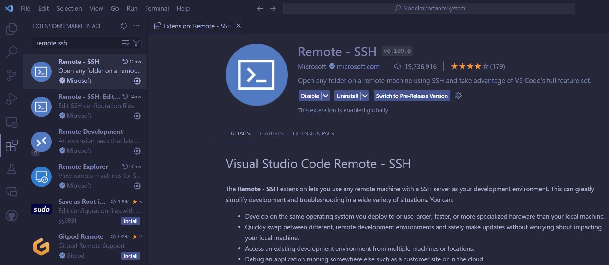
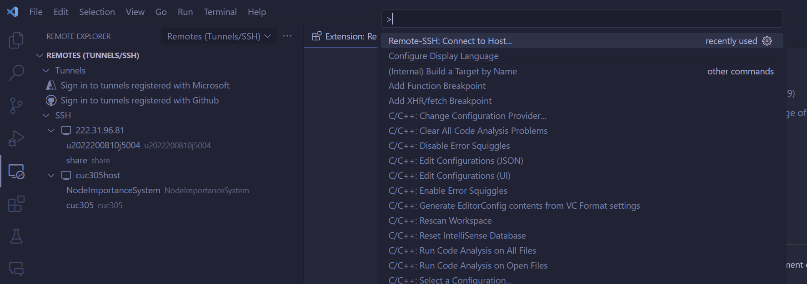
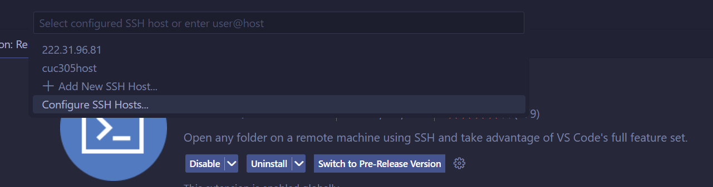
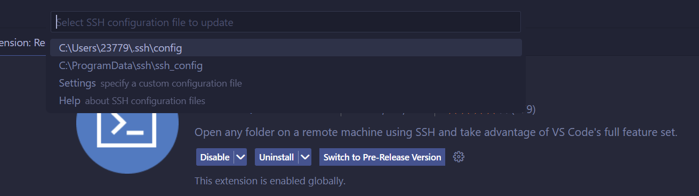
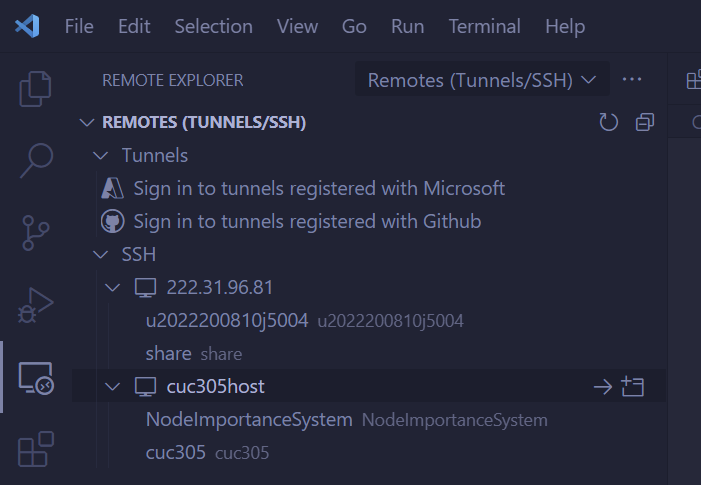
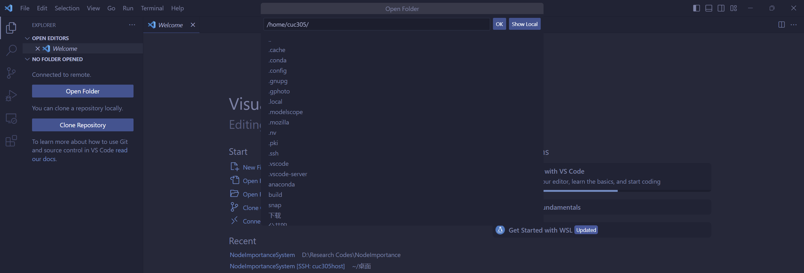
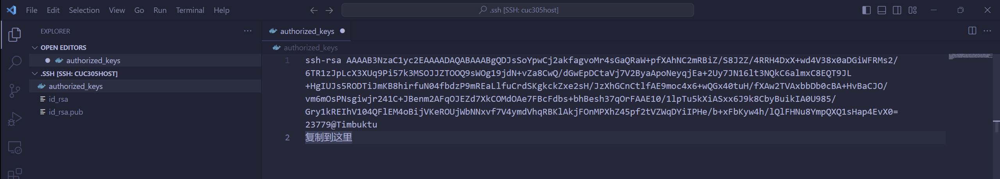
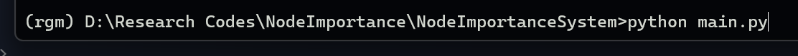

2024/03/16 update：为方便后续的一些实验和工作，实验室的DELL Precision T3660服务器系统更换为Ubuntu 20.04。这里简单介绍一下服务器的远程连接与使用。


## 一、远程连接

### 方法一：TODESK

比较简单的方法是下载todesk软件远程操控桌面，只需要主机的设备代码和密码即可

### 方法二：VSCode + Remote SSH

前置工作：

检查自己的电脑是否打开OpenSSH服务，在`服务`界面可以查找。或者在cmd窗口输入以下命令：

```bash
net stop sshd
net start sshd
```

重启ssh服务即可

1. 下载vscode

   [Download Visual Studio Code - Mac, Linux, Windows](https://code.visualstudio.com/Download)

2. 安装Remote SSH扩展

   

3. `ctrl`+`shift`+`P`打开vscode的选项面板，输入Remote SSH，选择下面的`Remote SSH：Connect to Host`

   

4. 接着选择二级列表的Configure SSH Hosts，并点击第一项

   

   

5. 进入config文件后，输入下面的内容：

   ```bash
   Host AAAAAAAAA
      HostName BBB.BBB.BBB.BBB
      User CCC
      Port DDD

6. 在左侧remote ssh面板下选择你的Host，直接打开或创建新窗口。首次打开选择 Linux系统 - 并输入密码：

   <!--  -->
   

7. 打开后选择open folder即可选择要打开的文件夹：

   


- 如果连接一会儿后断开，可能是因为没有配置ssh_config文件，尝试下面的教程：

  [解决Windows 自带 OpenSSH 连接到 Linux 服务器时，一段时间无操作，连接断开的问题_windows原来有openssh,又安装了一个后,从linux ssh失败-CSDN博客](https://blog.csdn.net/qq_35077107/article/details/111317650)

- 如果不想每次都输入密码，尝试在vscode的config文件里添加下面的内容：

  ```bash
  IdentityFile C:\Users\你的用户名\\.ssh\id_rsa
  ```

  （写在HostName和User的同级位置）


  并根据下面的教程生成**id_rsa**和**id_rsa.pub**文件：

  [Windows 10 下生成 ssh 密钥_windows10 ssh密钥位置-CSDN博客](https://blog.csdn.net/henryhu712/article/details/112805339)

  接下来，将生成的**id_rsa.pub**文件的内容追加到服务器的`/home/cuc305/.ssh/authorized_keys`中（不要覆盖前面的，在下一行复制粘贴即可）

  

​	然后重新打开即可。


### 校外连接

由于Wireless-CUC是校园网，局域网内部可以直接访问，当处在校园外时可以通过学校的VPN实现连接。VPN下载地址如下：

[中国传媒大学SSLVPN (cuc.edu.cn)](https://vpn.cuc.edu.cn/portal/#!/login)

连接方法如下：

[校外VPN (cuc.edu.cn)](https://its.cuc.edu.cn/xwVPN/list.htm)


注：如果在**Step2 首次填写地址**处连接不上，尝试填写`https://vpn.cuc.edu.cn/`


## 二、程序运行

服务器已安装anaconda，python版本为3.11，直接在命令行窗口运行即可

```python
python xxx.py
```

### 关于虚拟环境的建议

运行代码时最好在terminal中创建属于自己的虚拟环境，避免版本冲突，操作如下：

1. 创建指定python版本的虚拟环境，**name**自行指定

   ```bash
   conda create -n name python==3.xx
   ```

2. 启动新创建的虚拟环境

   ```bash
   conda activate name
   ```

3. 安装自己需要的库文件（大部分情况下不指定版本也没事）

   ```bash
   pip install numpy==xxx.xxx networkx==xxx.xxx
   ```

4. 运行代码

   确保运行时命令行首部为刚刚创建的环境**name**，如：

   


## 三、本地大模型部署及调用(optional)

​	目前服务器上部署了阿里的QWEN-7B大模型，功能比较初级。感兴趣的话可以在modelscope或huggingface上了解如何部署。调用方法如下：

​	模型位置：**/home/cuc305/桌面/llm/**

​	调用文件：**qwen_generate.py**

​	调用方法

```python
from qwen_generate import generate
prompt = """
(.................................)
"""
answer = generate(prompt)
```

